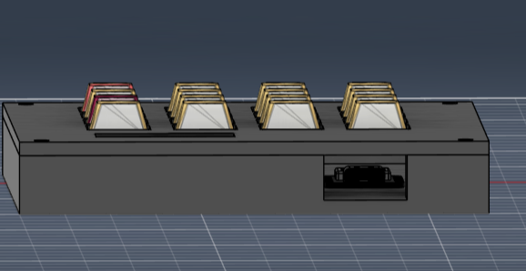
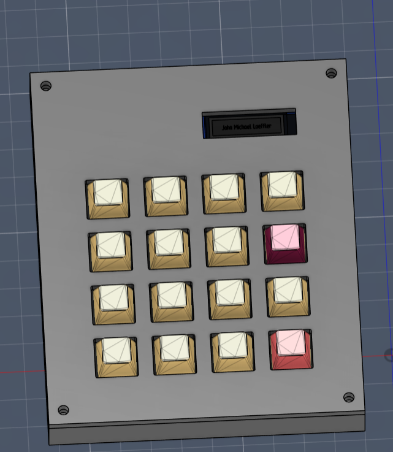
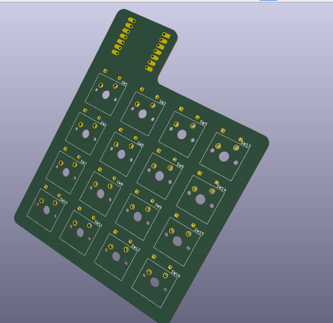
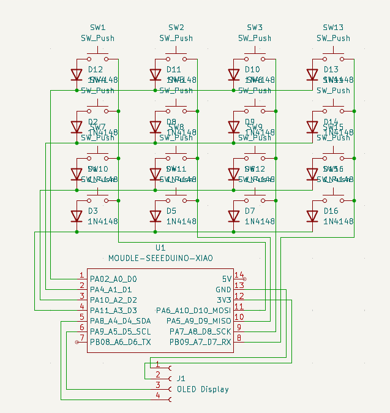
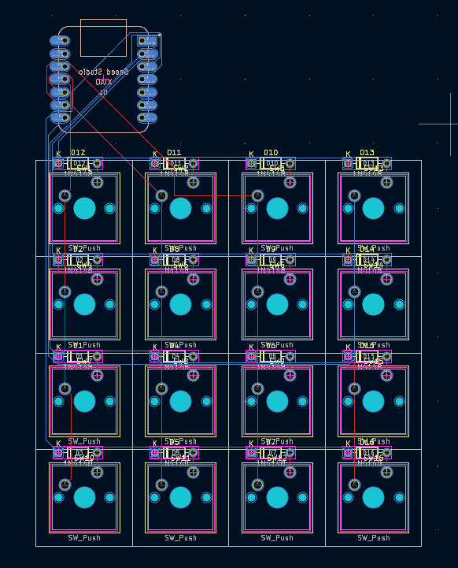
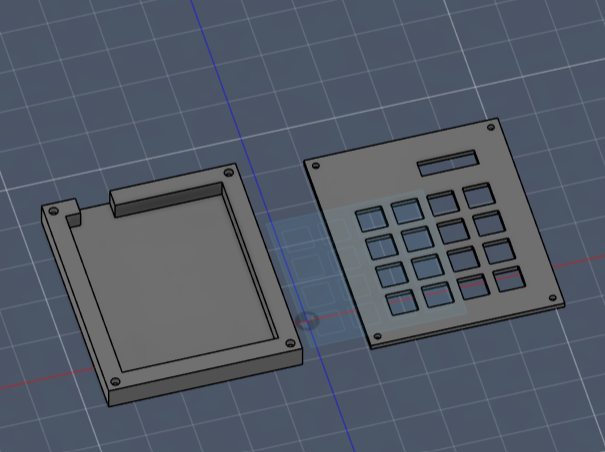

# StreamPad
The StreamPad is an open source hackpad made for macros (designed for streaming). It has 16 keys (4x4) and an OLED screen.

# PCB
Designed with KiCad.

# Case
Designed with fusion 360.

The macropad is assembled by pressing heat-set inserts into the back of the top plate. Then, 16mm screws are inserted through the bottom of the base and the PCB, threading directly into the inserts to hold everything together.

# Firmware
The firmware is written in KMK.

You will need to flash the .uf2 provided in the Firmware folder in this repo to the Seeeduino XIAO. (Refer to help here: https://wiki.seeedstudio.com/XIAO-RP2040-with-CircuitPython/)

After this, drag the files in the circuitpy folder provided in this repo into the CIRCUITPY drive that shows up after flashing circuitpython to the microcontroller. Do this as you would a flash drive.

# Assemble
Bill Of Materials (BOM):

1x XIAO RP2040

16x Cherry MX Switches

16x DSA Keycaps

4x M3x5x4 Heatset inserts

4x M3x16mm screws

16x 1N4148 DO-35 Diodes

1x 0.91" 128x32 OLED Display

My 3D printed case (Top & Bottom)

My PCB design. (I'm planning to use JLCPCB for the custom assembly of it)

You will also need to solder wires from XIAO to OLED. The wires will be self-provided: 

GND -> GND

3v3 -> VCC

D4 -> SDA

D5 -> SCL

You will then need to attach the OLED onto the top half of the case.

---

This was my first time ever using KiCad for PCB design, and my first time properly shipping an open source project like this. I learned a lot about this sort of stuff with this project, and made many mistakes I will remember not to make again lol.
Thanks to the Hackclub (and Stardance) team for providing these amazing resources that helped make this dream of mine come true :3
